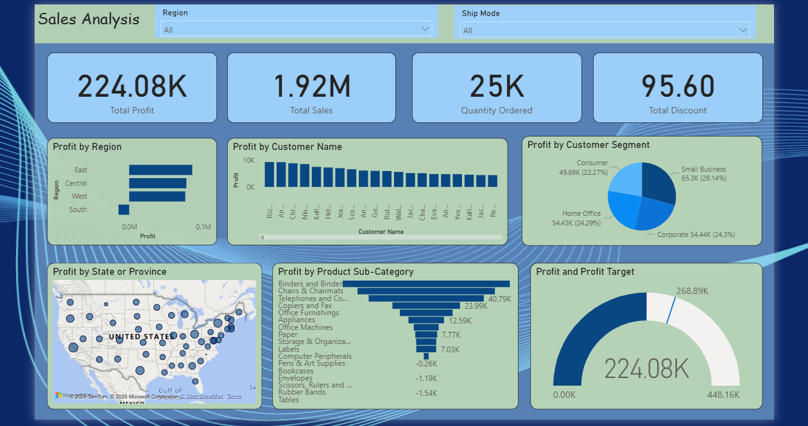

# Sales_Analysis_PowerBI
Power BI project analyzing sales performance across regions, customer segments, and products with KPIs like profit, sales, discounts, and targets.
# Sales Analysis Dashboard – Power BI

## Project Overview
This Power BI project analyzes sales data to provide actionable business insights.  
It tracks **Profit, Sales, Quantity Ordered, and Discounts** while breaking them down across regions, customer segments, and product sub-categories.  

## Features
- Total Sales, Profit, Quantity Ordered & Discounts (KPI Cards)  
- Profit by Region & State (Bar + Map visualizations)  
- Profit by Customer Segments & Top Customers  
- Profit by Product Sub-Category (including losses)  
- Actual vs Target Profit (Gauge Chart)  

## Tools Used
- Power BI Desktop  
- Excel (data source)  

## Files in this Repository
- `Sales_Analysis.pbix` → Power BI Project File  
- `Dashboard_Screenshot.png` → Dashboard Preview  
- `Dashboard.pdf` → Exported Report  
- `Problems_Solved.pdf` → Key business problems addressed  

##  Dashboard Preview

## Problems Resolved
See **Problems_Solved.pdf** for the key business questions answered through this dashboard.  

---
